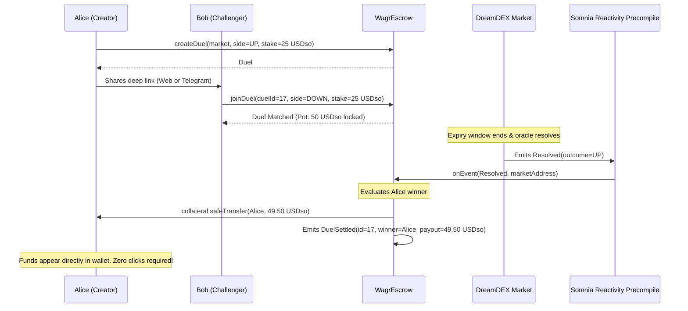
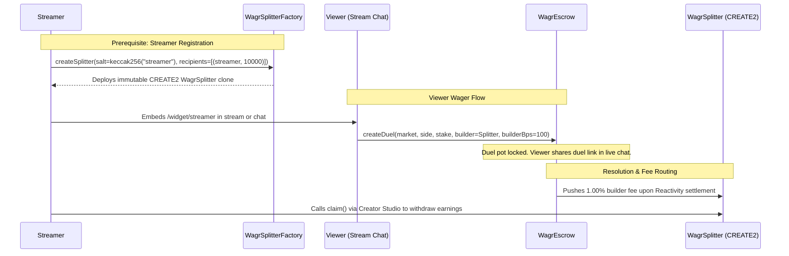

# Wagr

> Peer-to-peer prediction duels on DreamDEX event contracts with zero-click automated payouts powered by Somnia Reactivity.

**Live Application**: [https://wagr-app.vercel.app](https://wagr-app.vercel.app)  
**Create a Duel**: [https://wagr-app.vercel.app/create](https://wagr-app.vercel.app/create)  
**Settled Duel (Proof)**: [https://wagr-app.vercel.app/duel/3](https://wagr-app.vercel.app/duel/3)  
**Telegram Bot**: [https://t.me/WagrDuelBot/app](https://t.me/WagrDuelBot/app)  
**Developer Feedback**: [FEEDBACK.md](./FEEDBACK.md)

Wagr turns any DreamDEX binary market into a shareable 1v1 wager. When the oracle resolves the market, payouts are routed directly to the winner's wallet in the same block: zero claim vouchers, zero manual withdrawals, and zero user friction.

---

## Overview

DreamDEX provides on-chain event contract CLOBs on Somnia Shannon testnet. While central limit order books work for market makers, retail users and communities prefer direct head-to-head competition. Wagr acts as the distribution and social wagering layer on top of DreamDEX:

1. **1v1 Peer Duels**: Challenge any opponent via a shareable duel link tied to live DreamDEX market windows (1m, 5m, 15m, 1h, 4h, 24h).
2. **Zero-Click Automated Settlement**: When DreamDEX emits `Resolved`, Somnia's native reactivity precompile triggers `WagrEscrow.onEvent(...)` to settle the duel and push collateral straight to the winner. A permissionless relayer acts as a live fallback.
3. **Anti-MEV Commit-Reveal Wagers**: Players can stake in a sealed wager queue using cryptographic commitments (`keccak256(side, salt)`) to eliminate front-running and copy-trading.
4. **Creator Fee Splitters**: Streamers and creators deploy immutable CREATE2 splitters via `WagrSplitterFactory.sol`. Wagers placed through their custom embed widgets route DreamDEX builder fees (`approveBuilder`) directly to their splitter.
5. **Squad Seasons**: Tournament rooms with atomic multi-winner payouts verified on-chain through Merkle roots in `WagrSeason.sol`.
6. **Omnichannel Access**: Responsive web dApp with RainbowKit / Wagmi, plus a Telegram Mini App extension (`@WagrDuelBot`) with embedded Privy wallets for chat-native social wagering.

---

## Zero-Click Settlement Architecture

Traditional prediction markets force winners to return to the site, sign a claim transaction, and pay gas to retrieve winnings. 

Wagr settles duels automatically using Somnia's execution model:
- **Somnia Reactivity Transport**: `WagrEscrow` implements `ISomniaEventHandler`. Upon market resolution, Somnia validators call `onEvent(...)` from precompile `0x0000000000000000000000000000000000000100`.
- **Direct Push Payout**: Settlement calls `collateral.safeTransfer(winner, payout)` within the resolution transaction.
- **Relayer Fallback**: The Next.js backend endpoint `/api/settle` monitors resolution state and provides redundant settlement triggers so users never have to manually claim.



---

## Creator & Streamer Widget Lifecycle

Streamers and creators can monetize their audiences by embedding interactive prediction widgets into Twitch, Kick, YouTube livestreams, or linktrees:



### Complete 5-Step Lifecycle:

1. **Prerequisite: Deploy Splitter via Creator Studio (`/creators`)**:
   - Before earning fees, the creator visits `/creators`, enters their handle (e.g. `kaicenat`), and specifies their payout address.
   - Calling `Deploy Splitter` executes `WagrSplitterFactory.createSplitter(...)` via CREATE2, deploying an immutable, gas-efficient minimal proxy clone on Somnia Shannon.
2. **Embed or Share Widget Link (`/widget/[creator]`)**:
   - The creator embeds their custom widget URL (e.g. `https://wagr-app.vercel.app/widget/kaicenat`) into OBS browser sources, Twitch panels, or pinned live chat messages.
3. **Viewer Places a Wager**:
   - A viewer selects an active DreamDEX market, picks **UP** or **DOWN**, and deposits their stake (e.g., 10 USDso).
   - The widget resolves the creator's CREATE2 splitter address and routes the duel to `WagrEscrow.createDuel` with `builder = streamerSplitter` and `builderBps = 100` (1.00%).
4. **Chat Duel Matching & Reactivity Settlement**:
   - The viewer copies their live challenge link into stream chat. A second viewer takes the opposing side.
   - When DreamDEX resolves the market, Somnia Reactivity auto-triggers `WagrEscrow.onEvent(...)`.
   - The contract pushes the **1.00% builder fee (0.20 USDso on a 20 USDso pot)** directly into the streamer's splitter, while the winner receives their payout instantly.
5. **Streamer Revenue Withdrawal**:
   - The streamer returns to the `/creators` dashboard at any time to monitor total volume and pending fees.
   - Tapping **Claim Accrued Creator Fees** calls `WagrSplitter.claim()`, transferring all accumulated USDso to their wallet.

---

## Telegram Mini App Extension

As a social and mobile extension of the main platform, Wagr integrates directly into Telegram via `@WagrDuelBot` for chat-based 1v1 challenges and viral group sharing:

- **Bot Handle**: `@WagrDuelBot` ([t.me/WagrDuelBot/app](https://t.me/WagrDuelBot/app))
- **Direct Duel Deep Links**: `https://t.me/WagrDuelBot/app?startapp=duel_<id>`
- **Embedded Wallets**: Headless Privy authentication provisions a self-custodial smart wallet linked to the user's Telegram identity, with complete private key export support.
- **Automated Faucet Provisioning**: Automated background funding dispenses testnet STT (gas) and USDso (collateral) without leaving the chat interface.
- **Chat Native Sharing**: Leverages the Telegram WebApp SDK for 1-tap duel sharing to contacts or channels, haptic feedback, and auto-expanded viewport.

---

## Contracts (Somnia Shannon Testnet)

Network: **Somnia Shannon Testnet** (Chain ID: `50312`)  
RPC: `https://api.infra.testnet.somnia.network`

| Contract | Address | Purpose |
|---|---|---|
| **WagrEscrow** | [`0xc160f68e5f2e6846057ad6d4ada5d320b385c2cb`](https://shannon-explorer.somnia.network/address/0xc160f68e5f2e6846057ad6d4ada5d320b385c2cb) | P2P Duel Escrow, Commit-Reveal Queue, Reactivity Handler |
| **WagrSeason** | [`0x890506b7288573412674d8e8f34622aeb57fa708`](https://shannon-explorer.somnia.network/address/0x890506b7288573412674d8e8f34622aeb57fa708) | Squad Tournaments, Merkle Payouts, BitMap Claim Tracker |
| **WagrSplitterFactory** | [`0x1190048fb57e44fdedb418696075e884a9d89308`](https://shannon-explorer.somnia.network/address/0x1190048fb57e44fdedb418696075e884a9d89308) | CREATE2 Immutable Creator Fee Splitter Clones |
| **USDso (Collateral)** | [`0x70a86d8842fb63c4ad2b7cdddf530ebf1bb25d8e`](https://shannon-explorer.somnia.network/address/0x70a86d8842fb63c4ad2b7cdddf530ebf1bb25d8e) | DreamDEX Collateral (6 Decimals) |
| **Reactivity Precompile** | `0x0000000000000000000000000000000000000100` | Somnia Native Event Dispatcher |

*Verified On-Chain Proof Tx: [`0xb8290da3b70add14e567b43fb75bcfd56951e69110a0e5cd631fae83f8858f33`](https://shannon-explorer.somnia.network/tx/0xb8290da3b70add14e567b43fb75bcfd56951e69110a0e5cd631fae83f8858f33) (Block #477711153)*

---

## Verification and Testing Receipts

Full test suite with unit tests, stateful invariant fuzzing, and formal Halmos symbolic proofs. See [`verify/mutation.md`](./verify/mutation.md) for planted-defect testing.

| Test Suite | Method | Verified Results |
|---|---|---|
| **Unit Tests** | `forge test -vvv` | 24 passing unit tests covering WagrEscrow (19), WagrSeason (3), WagrSplitter (2) |
| **Invariant Campaigns** | Stateful Fuzzing | 2 campaigns (4,096 calls each; 128 runs at depth 32) verifying total escrow solvency |
| **Total Test Suite** | `forge test` | 26 passed, 0 failed, 0 skipped across 5 suites |
| **Halmos Symbolic** | `halmos` | 4 formal properties proving zero overpay, unresolved revert, void refund, and idempotency |
| **Code Coverage** | `forge coverage` | 100% source code coverage across core escrow functions |
| **Static Analysis** | Slither & CodeQL | Configured in CI with zero high or medium findings |

---

## Hackathon Judge Reproducer Commands

Run these one-liners directly in your terminal using Foundry `cast` to independently verify contract state and automated settlement on Somnia Shannon testnet:

### 1. Inspect Duel #1 on Shannon
Verifies duel state: Alice vs Bob stakes, market address, and settled flag:
```bash
cast call 0xc160f68e5f2e6846057ad6d4ada5d320b385c2cb "getDuel(uint256)((address,uint128,uint8,bool,address,uint128,address,uint64,address,uint16))" 1 --rpc-url https://api.infra.testnet.somnia.network
```

### 2. Verify Zero-Click Settlement by Precompile
Inspect the `DuelSettled` event for Duel #1 showing instant payout execution at block `#477711153`:
```bash
cast logs --address 0xc160f68e5f2e6846057ad6d4ada5d320b385c2cb "DuelSettled(uint256,address,uint8,uint256,bool,bool)" --from-block 477711000 --to-block 477711500 --rpc-url https://api.infra.testnet.somnia.network
```

### 3. Read Aggregate On-Chain Volume
Query total USDso volume escrowed and settled by Wagr on Shannon:
```bash
cast call 0xc160f68e5f2e6846057ad6d4ada5d320b385c2cb "totalWagered()(uint256)" --rpc-url https://api.infra.testnet.somnia.network
```

---

## Local Setup & Testing

### 1. Smart Contracts
Install dependencies and run the test suite:
```bash
cd contracts
forge install foundry-rs/forge-std openzeppelin/openzeppelin-contracts@v5.0.2 --no-commit
forge test -vvv
```

### 2. Frontend Application
```bash
cd web
pnpm install
cp .env.example .env.local
pnpm run dev
```

*(Optional) Testing Telegram Mini App locally with a tunnel:*
```bash
ngrok http 3000
# Update your Bot WebApp URL in BotFather to the tunneled HTTPS URL
```

---

## Repository Structure

```
wagr/
├── contracts/          Foundry contracts, unit tests, symbolic proofs, invariants
│   ├── src/            WagrEscrow.sol, WagrSeason.sol, WagrSplitter.sol, WagrSplitterFactory.sol
│   ├── script/         Deploy.s.sol, SeedDemo.s.sol
│   └── test/           Unit tests, Halmos symbolic proofs, invariant campaigns
├── keeper/             Reactivity subscriber service and fallback polling keeper
├── web/                Next.js 14 frontend (Tailwind CSS, RainbowKit, Wagmi, Viem, Privy, TMA SDK)
│   ├── app/            Duel arena, catalog, dashboard, creator studio, widget embed
│   ├── components/     Victory/defeat modal, live countdowns, reactive telemetry, Telegram provider
│   └── lib/            Contract ABIs, address mappings, DreamDEX GraphQL queries, Telegram helpers
├── verify/             Static analysis, mutation testing docs, SDK differential ABI checks
├── deploy/             Deployment receipts and address configurations
└── README.md
```

---

*Built for the Somnia x DreamDEX Event Contracts Hackathon.*
